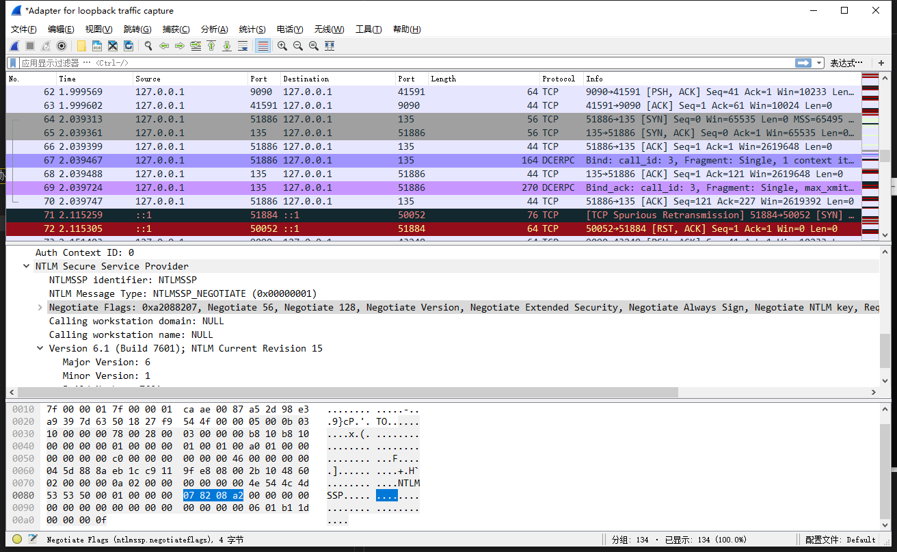
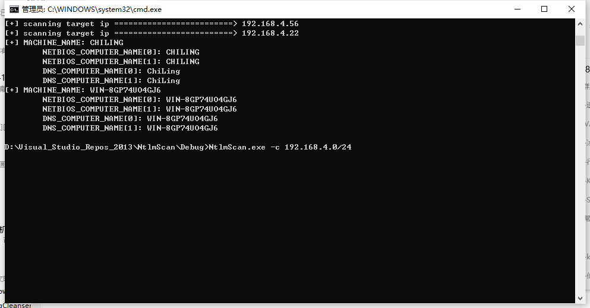

# Ntlm-Scan

## 学习点：

1、NTLM协议数据包的解析的学习

2、NTLM协议的学习

3、C的学习

注：只完成了其中基于WMI 135端口NTLM协商的探测

## 功能

1、基于NTLM type2探测内网主机信息工具

- 远程收集(remoteGather)
  - [√] 基于 NTLM type2 135端口收集主机信息
  - [ ] 基于 NTLM type2 445端口收集主机信息
  - [ ] 基于 NTLM type2 5985端口收集主机信息
  - [ ] 基于 OXID DCOM接口收集多主机网卡

## 工具使用

`ntlmscan.exe -c 192.168.4.0`

