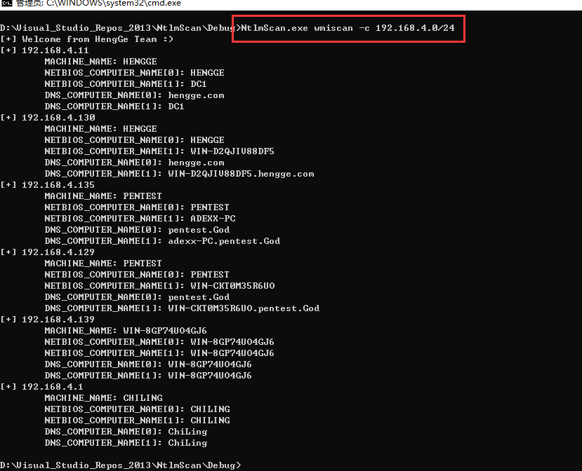
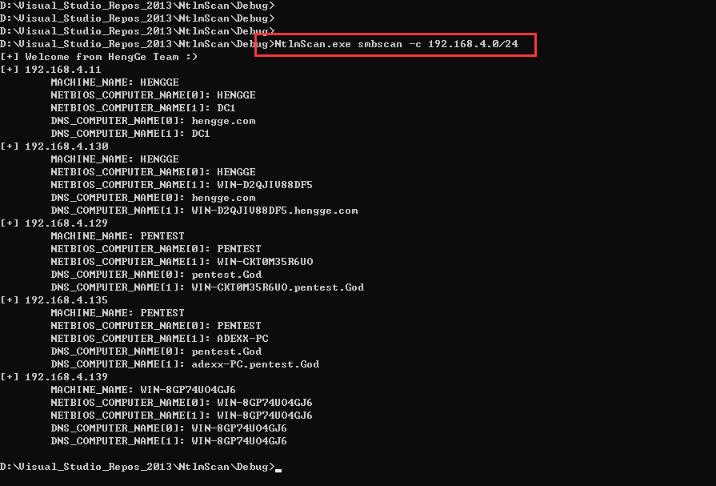

# Ntlm-Scan

## 学习点：

1、内网协议学习

2、内网攻击方法学习

3、C的学习

## 功能

- 远程收集(remoteGather)
  - [√] 基于 NTLM type2 135端口探测主机信息
  - [√] 基于 NTLM type2 445端口探测主机信息
  - [ ] 基于 NTLM type2 5985端口探测主机信息
  - [√] 基于 OXID DCOM接口探测多主机网卡
  - [ ] 基于 域内委派配置不当探测
  - [ ] 基于 LDAP探测
- 本地收集(localGather)
  - [√] 基于 提权可读写目录探测
   - [ ] 基于 指定后缀名文件探测
  - [ ] 基于 杀毒软件探测
- 利用(Exploit)
  - [ ] 基于 IPC Brute
  - [ ] 基于 WMIC Brute
  - [ ] 基于 Default WMI PTH
  - [ ] 基于 Default SMB PTH
  - [ ] 基于 TCP加密流量代理
  - [ ] 基于 http.sys端口复用后门

## 工具使用

`ntlmscan.exe wmiscan -c 192.168.4.0/24`

`ntlmscan.exe smbscan -c 192.168.4.0/24`

`ntlmscan.exe oxidscan -c 192.168.4.0/24`

`ntlmscan.exe oxidscan -c 192.168.4.0/24`

## 参考文章

https://github.com/0x727/ShuiYing_0x727

https://github.com/SkewwG/domainTools